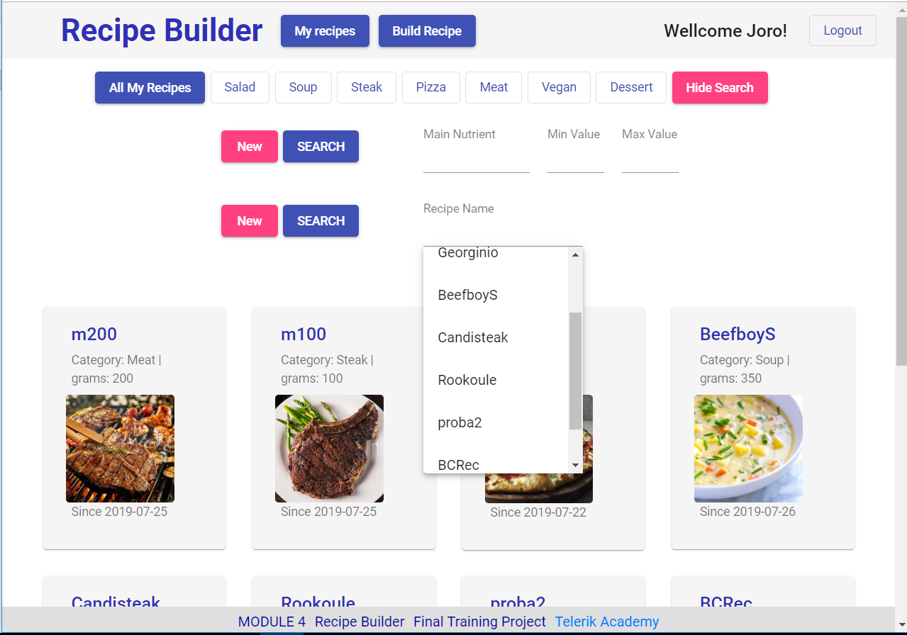

# RECIPE NUTRITION CALCULATOR
## / Recipe Builder /

This project was generated with [Angular CLI](https://github.com/angular/angular-cli) version 7.3.9.

## Main Description
The **Recipe Builder** is the final Project Assignment at Telerik Academy Aplpha with JavaScript - 2019.

The project goal is to design and implement a single-page web application that will allow restaurant chefs to create and manage recipes composed of products with known nutrition values. During the interaction with the system users see changes in nutrition information in real time. Newly created recipes could be tagged with a category from a list.

The application has a public part (accessible without authentication) and a private part (available only for registered users - chefs)

### Public Part
The public part is visible without authentication. 
It consists of a registration screen, where every new user can make a registration, and a login screen, which users use to authenticate.

**Users can Register/Login** 

### Private (Chefs only) Part 
Chefs have a private part in the web application accessible only after successful login.
 

**Users can Logout or redirect to all My Recipes or Build Recipe** 

 

---

**Users can filter the recepies by category** 

---

**Users can search for a recipe by its name** 

---

**Users can search for a recipe by a chosen nutrient**  
The filter allows a consecutive search by several different nutrients

---

**Users can get deatiled information about a chosen recipe** 

---

**Users can create, modify or delete recipes /Build Recipe/**  
When creating a recipe, the user can serach for products and filter by product groups, and can also choose from and add existing recipes 

---

## How to start ##

* Clone the project repository - 
`git clone https://gitlab.com/georgievgeorgi/recipe_builder.git`

* Install all dependencies - `npm install`

* Start the web application - `ng serve -o`

* Run unit tests to execute the unit tests - `ng test`

## Contributors: ##
Members of Team 9  
      **Александър Георгиев** 
      **Георги Георгиев**